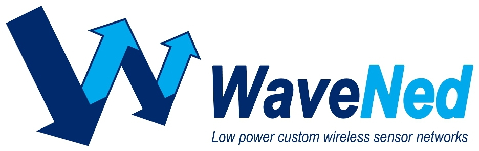

# What is WaveNed?
WaveNed is an extensible wireless protocol for custom wireless solutions.
It is secure, robust and can be tailored to the specific needs of a product.

# What can you do with it?
We created a simple indoor localization system using the wristband devices from the Nemo experiment.
They will enable you to roughly position a user in the smart home space and detect proximity to a point of interest.
Also you can build some control based on the button on the wristband or the 3D orientation of the device.
There are obviously many ways to use this, so have fun!

You can read the manual [here](WaveNed WSN for smart home experiments.pdf)
